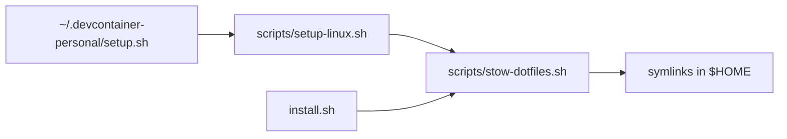

# Using these dotfiles in a dev container

These dotfiles are split into a portable core plus platform-specific fragments,
so the same public repo works on macOS and inside a Linux dev container (Cursor
/ VS Code) without dragging along the macOS bootstrap.

## What gets applied where

| Area | macOS (`install.sh`) | Linux container (`scripts/setup-linux.sh`) |
|------|----------------------|--------------------------------------------|
| Shell core (`bash/.bashrc.common`, `.aliases`) | yes | yes |
| Platform shell fragment | `bash/.bashrc.darwin` | `bash/.bashrc.linux` |
| Git base + platform fragment | `git/gitconfig.darwin` | `git/gitconfig.linux` |
| Starship prompt config (`~/.config/starship.toml`) | yes | yes |
| Homebrew, casks, iTerm, GIMP | yes | no |
| NVM / pyenv | yes | no (Node comes from the devcontainer feature + Corepack) |
| `.macos` defaults, VS Code mac symlinks | yes | no |

The container path deliberately installs only a prompt and a few optional CLI
tools, then stows the dotfiles. It never runs `install.sh` or `.macos`.

## How it is wired

Both entry points end by calling `scripts/stow-dotfiles.sh`, which uses GNU
Stow to symlink the `bash`, `git`, and `starship` packages into `$HOME` (the
starship config lands at `~/.config/starship.toml`) and then
links `~/.gitconfig.platform` to the OS-specific git fragment (Git has no native
OS-conditional include).



## Setting up personal customizations in a dev container

Your monorepo ships a shared `.devcontainer/setup.sh` that, after the core
setup, runs `~/.devcontainer-personal/setup.sh` if it exists. Put the following
in that personal script (or copy it from `.devcontainer/personal-setup.example.sh`):

```bash
#!/usr/bin/env bash
set -euo pipefail

# Personal dotfiles (optional)
DOTFILES_REPO="${DOTFILES_REPO:-https://github.com/razorman8669/dotfiles.git}"
DOTFILES_DIR="${DOTFILES_DIR:-$HOME/.dotfiles}"

if [ ! -d "$DOTFILES_DIR/.git" ]; then
  echo "Cloning dotfiles..."
  git clone "$DOTFILES_REPO" "$DOTFILES_DIR"
fi

echo "Applying dotfiles (linux)..."
bash "$DOTFILES_DIR/scripts/setup-linux.sh"
```

### Environment variables

- `DOTFILES_REPO` - override the clone URL (e.g. to use a fork or SSH remote).
- `DOTFILES_DIR` - override the clone location (defaults to `~/.dotfiles`).

### Opting out of tools

`scripts/setup-linux.sh` installs `starship` (required by the prompt) plus
optional `ripgrep`, `fzf`, `bat`, and `zoxide`. To drop any of them, comment out
the matching line in step 3 of that script. All installs are guarded with
`command -v`, so re-running is safe.

## Persistence note

The clone under `~/.dotfiles` and the stowed symlinks live for the lifetime of
the container. `scripts/setup-linux.sh` seeds `~/.gitconfig.local` from
`gitconfig.local.example` on first run; edit it with your name and email. To keep
real identity/signing settings across rebuilds, mount `~/.devcontainer-personal/`
as a volume (or a secret file) and copy them in from your personal script.
